# University Platform

A QR-code based university attendance system with real-time updates and grade management. A professor opens a session that generates a QR code; students scan it to check in; the professor's dashboard updates live as students arrive. The system has three roles: ADMIN, PROFESSOR, and STUDENT.

The repository holds two services:

- `backend/` — Spring Boot 3.2 / Java 17 (Maven), the REST + WebSocket API
- `frontend/` — React 18 + Vite

Plus `database/schema.sql` (Database definiton + seed data) and `docker-compose.yml` for the
full stack.

## How it works

Check-ins flow asynchronously. The frontend posts a check-in, the backend validates it and publishes it to a RabbitMQ queue, a consumer persists the attendance row, and the result is pushed back to the professor dashboard over a STOMP WebSocket topic. PostgreSQL stores users, courses, sessions, attendance, and grades.

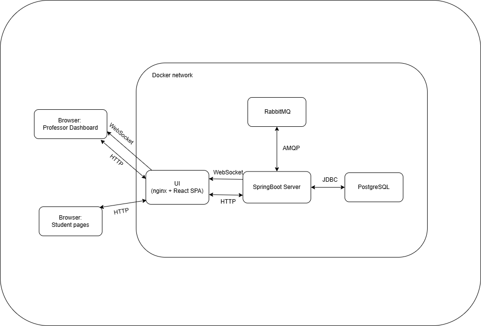

## Run on local machine

### With Docker (recommended)

```bash
docker-compose up
```

Frontend: http://localhost:3000  
Backend API: http://localhost:8090 (8080 inside container)  
API Swagger: http://localhost:8090/swagger-ui/index.html#/   
pgAdmin http://localhost:5050 (pass: admin)   
RabbitMQ: http://localhost:15672 (guest:guest)

### Manual run

You need a running PostgreSQL and RabbitMQ. Also Java 17, Maven (3.9), Node.js (22.19), npm (11.12). Apply `database/schema.sql` to your database and config connections in "application.properties" and "vite.config.js" 

Backend: from `/backend/` run:

```bash
mvn spring-boot:run # runs on 8080
```

Frontend: from `/frontend/` run:

```bash
npm install
npm run dev # Vite dev server on 3000
```

The Vite dev proxy targets port 8090 (the Docker-mapped backend port). When running the backend directly with `mvn spring-boot:run` it listens on 8080, so either adjust the proxy in `vite.config.js` or run the backend in Docker.

## Screenshots

| Professor dashboard | Live attendance |
| --------- | --------------- |
| 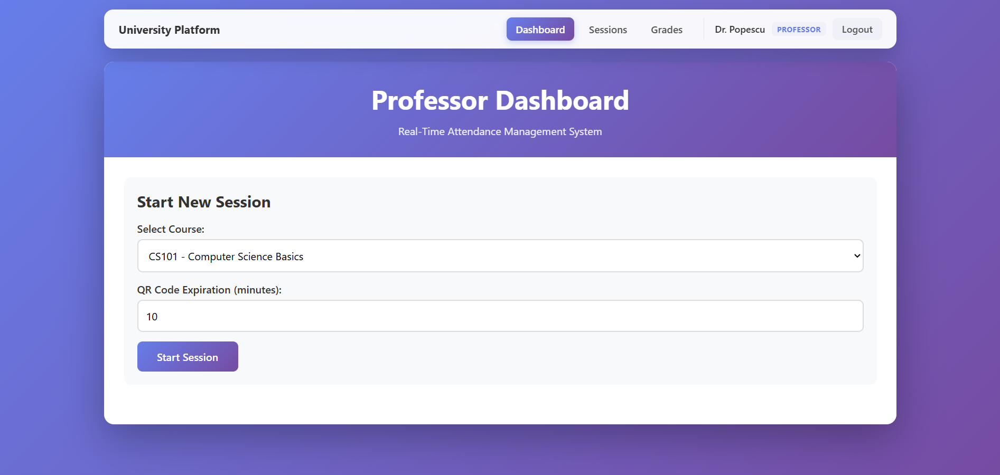 | 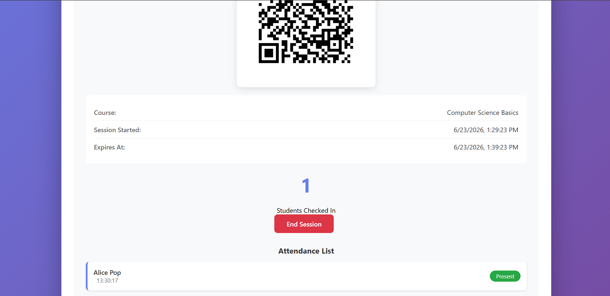 |

| Grade management | Session history |
| ---------------- | --------------- |
| 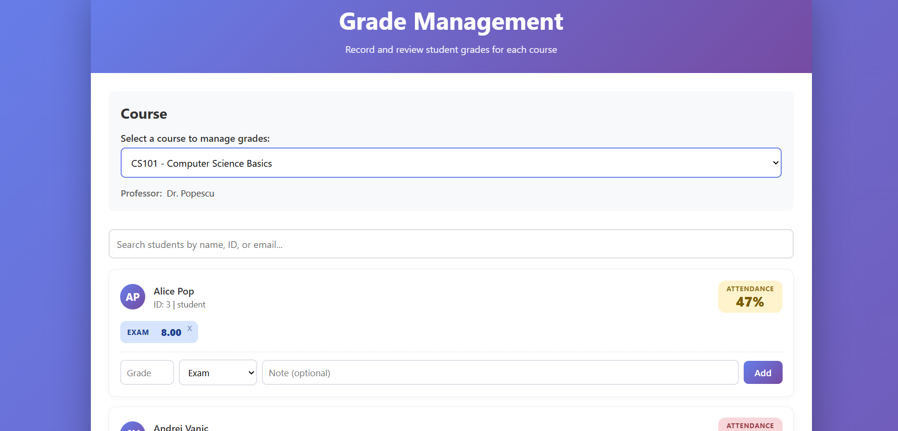 | 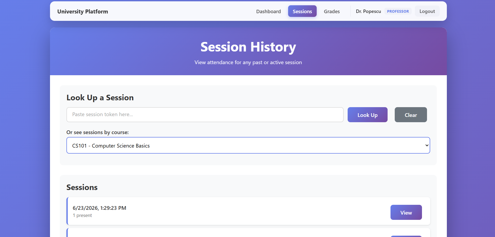 |

| Check-in confirmation | Attendance | Grades |
| --------------------- | ---------- | ------ |
| 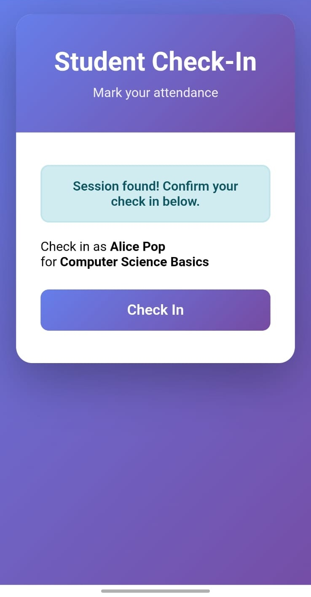 | 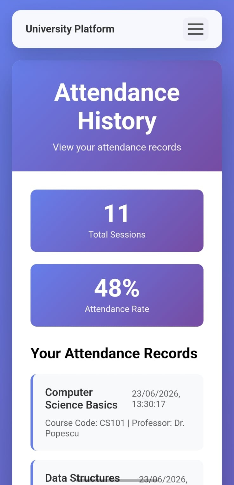 | 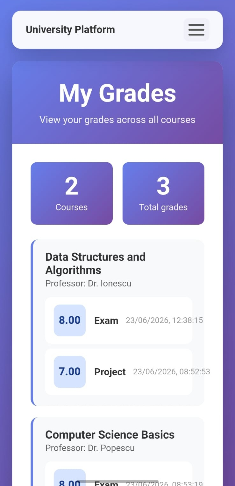 |

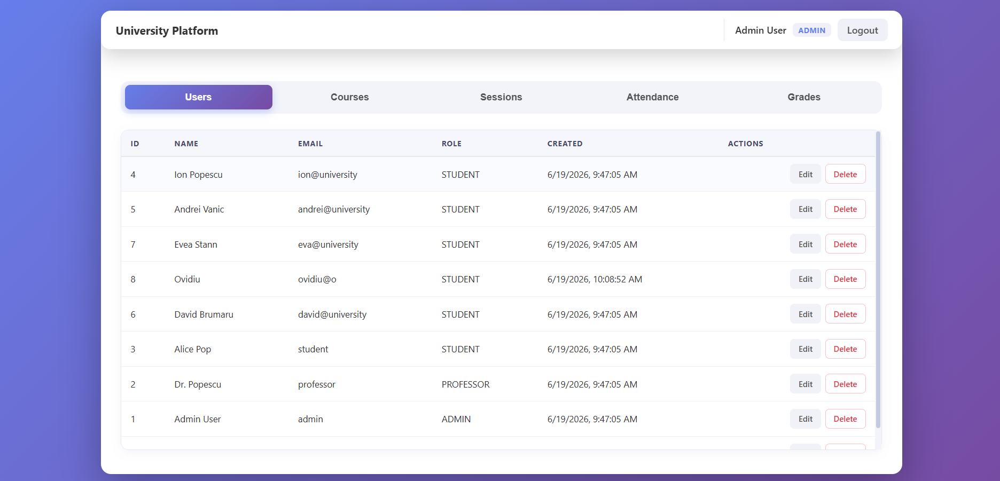

| Login | Register |
| ----- | -------- |
| 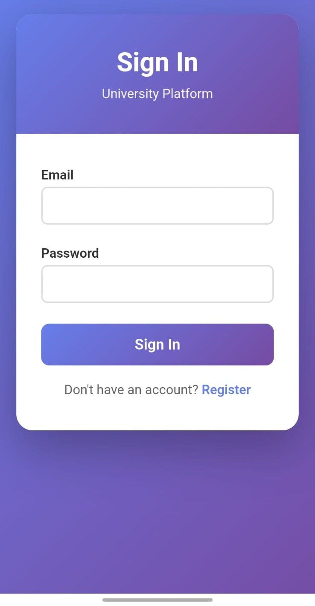 | 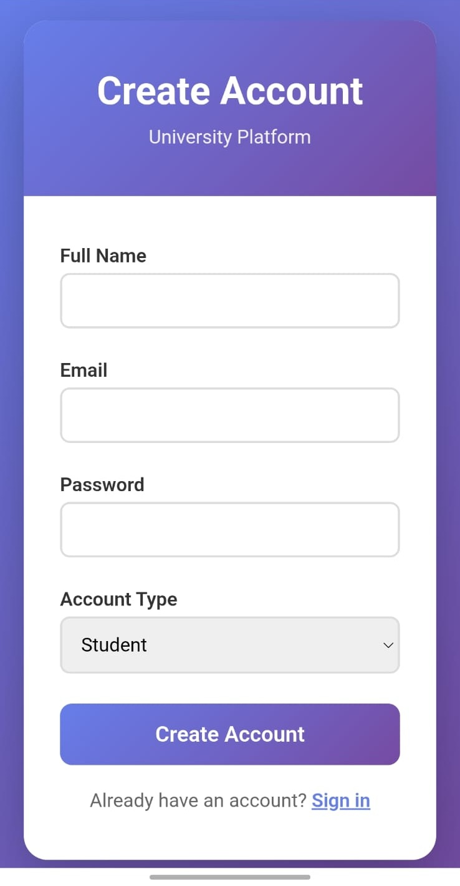 |
