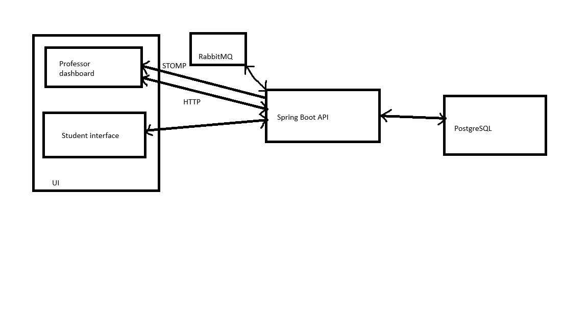
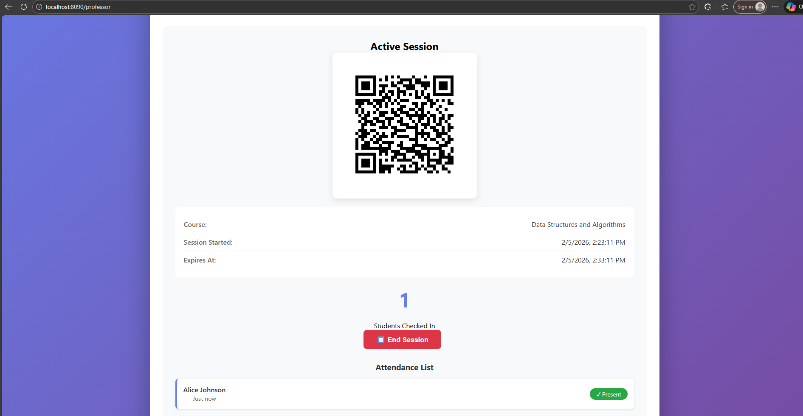
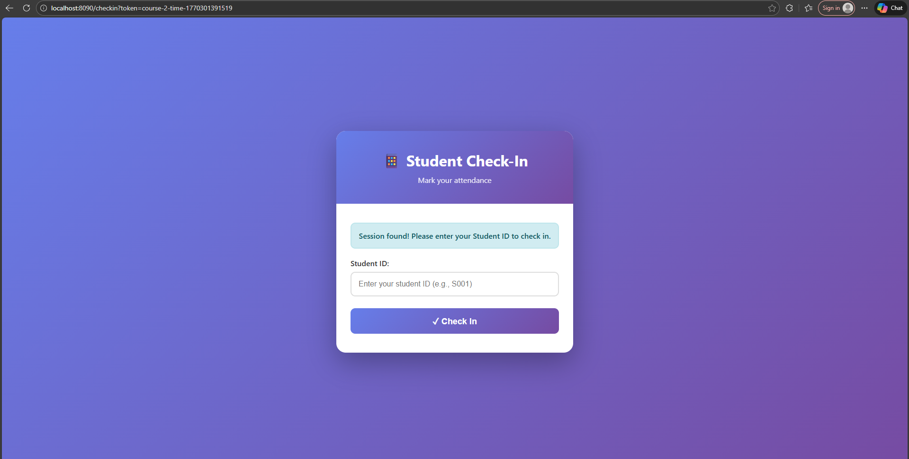
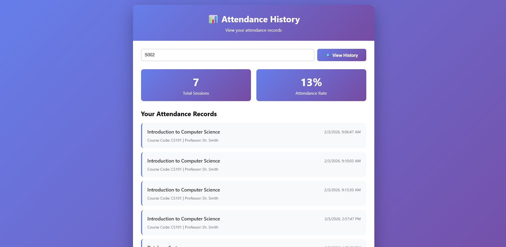

# [Project Name] - SSATR IA 2025

**Student:** Ples Ovidiu Vasile Claudiu   
**Scenario:** 1. Real-Time Attendance System

---

## Project Overview

Classroom attendance system with QR code generation and real-time tracking

### Key Features

- Feature 1: QR Code Generation: Professors can generate unique, time-limited QR codes for each class session
- Feature 2: Real-Time Updates: Live attendance counter and student list updates 
- Feature 3: Session Management: Configurable expiration times, active/ended session states
- Feature 4: Professors can view past session attendance; students can track their records

---

## Technology Stack

### Backend
-	Java 17 with Spring Boot 3.2.0   
-	RabbitMQ for message queuing    
-	PostgreSQL 15    
-	Spring WebSocket (STOMP)    
-	ZXing

### Frontend
-	Thymeleaf templates with HTML5/CSS3    
-	Vanilla JavaScript (no frameworks)     
-	SockJS and STOMP.js for WebSocket client     

### Infrastructure
-	Docker and Docker Compose  
-	Maven 3.9
---

## System Architecture

### High-Level Architecture
Frontend communicates with the Java Springboot API through HTTP requests and a WebSocket (for real time attendance). The API uses a RabbitMQ client to handle parallel check in requests, and then a RabbitMQ consumer process those requests and store them in the PostgreSQL databse.



**Main Components:**

1. **UI pages**: Interact with the and user and the API
2. **Springboot API**: Process data and stores/reads it from PostgreSQL
3. **RabbitMQ**: Temporarly store checkin requests to ensure correct processing and handle multiple requests at the same time.      
4.  **PostgreSQL**: Stores data

### Data Flows

- Student requests a check in after scanning the QR and enter the student interface. This request is sent to API and then sent to the RabbitMQ list. A rabbitMQ listener fetches the messages (checkin requests) and processes them one by one.
- After a checkin request in processed, it is stored in the database and also sent to the professor dashboard through a web socket
- Student history and session history are available using simple HTTP requests to the API that returns the stored data from the database

---

### Simulations and Simplifications

[Explain what aspects were simulated or simplified for the proof-of-concept]
- Attendance rate is calculated as a ratio of all the available courses
- QR code scanning simulated on the web with a QR reader, as the application is hosted locally and not accesible from the phone

## Screenshots

   ### Professor dashboard
   

   ### Check in page
   

   ### Student history
   

   ### Session history
   

---

## Database Schema

The database tables are: 
- students
- courses
- session (references courses)
- attendance (references sessions and students)

---

## Running the Application

### Prerequisites

- Docker and Docker Compose
- Web browser

### Setup Instructions

1. **Clone the repository**
```bash
   git clone https://github.com/OvidiuPles/ssatr-lab-PlesOvidiu.git
   cd project
```

2. **Start infrastructure services**
```bash
   docker-compose up
```

3. **Wait for the app to start**    
Wait untill the last container (the springboot app container) is running. The last log line should be: 

"Started AttendanceSystemApplication in ... seconds"

6. **Access the application**
   - Professor dashboard: http://localhost:8090/professor
   - Session history: http://localhost:8090/professor/history
   - Student checkin: http://localhost:8090/checkin?token=<TOKEN_FROM_QR>
   - Student history: http://localhost:8090/student/history


---


## Future Improvements

- Link students to courses and improve the attendance rate
- Create a full mobile app for students

---

